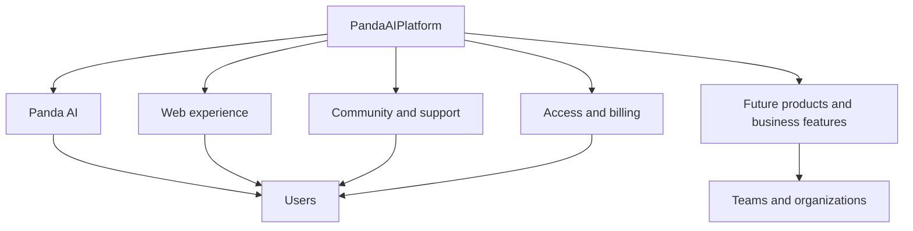
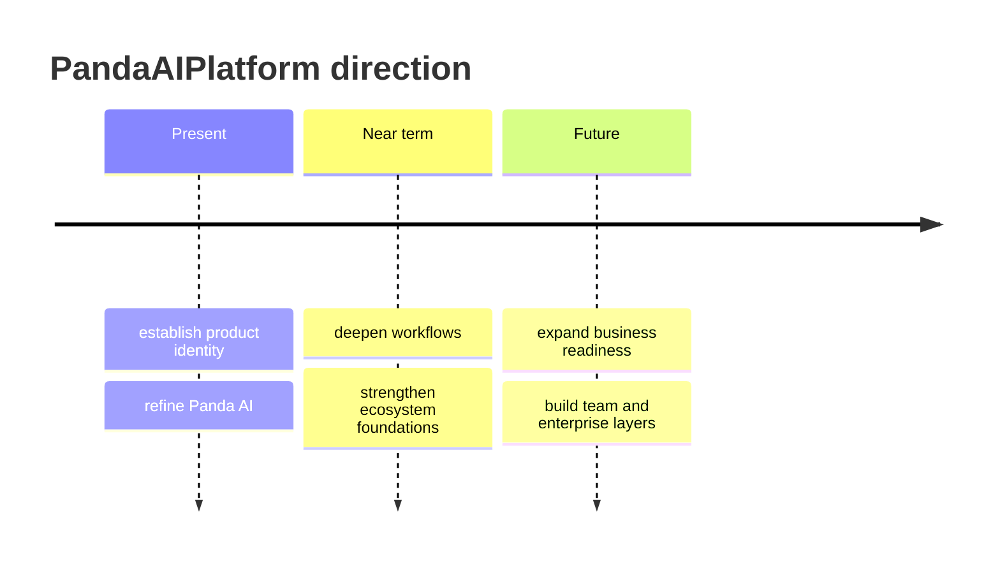

# PandaAIPlatform

  

  

  <strong>Building premium AI products that make powerful technology feel simple, refined, and genuinely useful.</strong>

  PandaAIPlatform is the home of Panda AI and the broader product ecosystem behind it: modern AI tools shaped around clarity, quality, design, and a more complete user experience across web, workflows, and community surfaces.

  <em>Less noise. Less fragmentation. Less generic AI branding.</em>

  <em>More continuity, more product depth, more trust, and more intention behind every surface.</em>

  <a href="https://github.com/PandaAIPlatform">Organization</a>
  ·
  <a href="https://github.com/PandaAIPlatform/Panda-AI">Flagship Product</a>
  ·
  <a href="https://ai.discordlabs.app">Website</a>
  ·
  <a href="https://dc.muzes.xyz/">Community</a>

  
  
  
  
  
  

> [!IMPORTANT]
> PandaAIPlatform is not being positioned as a random collection of repositories. It is being shaped as the long-term home for premium AI products, infrastructure, and product experiences with a clear point of view.

## Table Of Contents

- [Cinematic Hero](#cinematic-hero)
- [What PandaAIPlatform Is](#what-pandaaiplatform-is)
- [Why This Organization Exists](#why-this-organization-exists)
- [Brand Philosophy](#brand-philosophy)
- [What We Build](#what-we-build)
- [Flagship Product](#flagship-product)
- [Why This Feels Different](#why-this-feels-different)
- [Product Principles](#product-principles)
- [Ecosystem View](#ecosystem-view)
- [Who We Build For](#who-we-build-for)
- [Operating Direction](#operating-direction)
- [Roadmap Direction](#roadmap-direction)
- [Trust And Quality](#trust-and-quality)
- [Links](#links)

## Cinematic Hero

PandaAIPlatform exists to build AI products that feel like real products, not disposable interfaces wrapped around whichever API is trending this month.

The belief behind this organization is simple: powerful technology becomes more valuable when it is shaped into something coherent, memorable, and easy to return to. That means strong product thinking. Strong visual identity. Strong workflow design. Strong operational foundations. Not just raw capability.

This organization is where that work lives.

## What PandaAIPlatform Is

PandaAIPlatform is the product organization behind Panda AI and future products built around the same standard:

- premium product quality instead of anonymous tooling
- clear workflows instead of scattered feature piles
- strong identity instead of generic AI aesthetics
- long-term usability instead of short-term novelty
- serious foundations instead of surface-level polish

This is meant to be the brand home, engineering home, and product home for everything that grows from that vision.

## Why This Organization Exists

Most AI tools still feel fragmented.

One product is for chat. Another is for images. Another is for code. Another holds billing. Another holds integrations. Another handles the community side. Even when each piece works, the whole experience feels disconnected.

PandaAIPlatform exists to build the opposite kind of future: one where products feel unified, deliberate, and worth staying inside.

The goal is not only to ship features. The goal is to shape systems people actually remember.

> [!NOTE]
> The strongest AI products of the next wave will not win only on model access. They will win on product feeling, trust, workflow continuity, and the quality of the full environment around the model.

## Brand Philosophy

We care about what the product does, but we also care about what it feels like.

That means:

- interfaces that feel intentional
- workflows that feel connected
- language that sounds human
- product surfaces that feel branded
- systems that can grow into business-grade experiences later

PandaAIPlatform is built around the idea that calm, premium, high-clarity software can stand out more than noisy feature maximalism.

## What We Build

| Area | Focus |
| --- | --- |
| AI products | User-facing products built around practical, high-quality AI workflows |
| Product systems | Shared account, access, billing, and operational foundations |
| Community surfaces | Connected experiences across website, support, and community channels |
| Brand infrastructure | A recognizable product identity instead of interchangeable AI visuals |
| Future business layers | Foundations for team, business, and enterprise-grade evolution |

## Flagship Product

### Panda AI

Panda AI is the flagship product in the PandaAIPlatform ecosystem.

It is designed as a premium AI workspace where users can access strong models, cleaner workflows, better product polish, and a more cohesive environment than the usual fragmented multi-tab experience.

  

Core direction behind Panda AI:

- one refined place for everyday AI work
- one stronger product identity
- one clearer path from idea to output
- one foundation that can grow beyond a single interface

## Why This Feels Different

| Category | Typical AI orgs | PandaAIPlatform |
| --- | --- | --- |
| Identity | Generic and disposable | Recognizable and intentional |
| Product thinking | Feature-first | Experience-first and workflow-aware |
| Scope | Single-surface tools | Ecosystem mindset |
| Brand language | Technical but forgettable | Premium, human, memorable |
| Long-term direction | Repo collection | Product platform |

## Product Principles

The principles behind our work are straightforward:

1. Great technology should feel easy to approach.
2. Premium software should feel calm, not cold.
3. Brand matters because trust starts before the first click.
4. Good workflows matter more than inflated feature counts.
5. Foundations matter because serious products must survive growth.

## Ecosystem View

This organization is intended to support more than one surface over time:

- product repositories
- shared infrastructure
- brand-facing assets
- future internal tools
- future business and team systems

## Who We Build For

| Audience | What they want |
| --- | --- |
| Everyday users | A better AI experience without chaos |
| Creators | Cleaner workflows and stronger outputs |
| Builders | A more serious product environment |
| Communities | Better continuity between product and support surfaces |
| Future teams | Structure, clarity, and room to scale |

## Operating Direction

PandaAIPlatform is being built with a product mindset first.

That means the bar is not simply whether something works. The bar is whether it is clear, polished, scalable, and worthy of becoming part of a larger ecosystem.

We care about:

- design consistency
- strong naming and brand presence
- reusable product foundations
- operational clarity
- future commercial readiness

## Roadmap Direction

| Phase | Focus |
| --- | --- |
| Present | Build a memorable flagship and clean brand foundation |
| Near term | Improve workflows, polish, and supporting infrastructure |
| Mid term | Expand product depth and ecosystem cohesion |
| Long term | Grow into stronger business, team, and enterprise capability |

## Trust And Quality

Trust is part of the product, not a separate afterthought.

As PandaAIPlatform grows, the direction is toward stronger foundations in:

- reliability
- permissions and control
- operational visibility
- account and billing clarity
- product consistency across surfaces

That is how a project stops feeling experimental and starts feeling dependable.

> [!TIP]
> Premium positioning only works when the foundations are strong enough to support it.

## Links

- Organization: [PandaAIPlatform](https://github.com/PandaAIPlatform)
- Flagship product: [Panda AI](https://github.com/PandaAIPlatform/Panda-AI)
- Website: [ai.discordlabs.app](https://ai.discordlabs.app)
- Community: [dc.muzes.xyz](https://dc.muzes.xyz/)

---

  <strong>PandaAIPlatform</strong> 
  Building a more refined home for modern AI products.

